```mermaid
flowchart TB
    subgraph current["CatalogApi.csproj"]
        MAIN["<b>📦&nbsp;CatalogApi.csproj</b><br/><small>net8.0</small>"]
        click MAIN "#c:githubcatalogapicatalogapicatalogapicsproj"
    end

```

```mermaid
flowchart TB
    subgraph current["NotificationsApi.csproj"]
        MAIN["<b>📦&nbsp;NotificationsApi.csproj</b><br/><small>net8.0</small>"]
        click MAIN "#c:githubnotificationsapinotificationsapinotificationsapicsproj"
    end

```

```mermaid
flowchart TB
    subgraph current["PaymentsApi.csproj"]
        MAIN["<b>📦&nbsp;PaymentsApi.csproj</b><br/><small>net8.0</small>"]
        click MAIN "#c:githubpaymentsapipaymentsapipaymentsapicsproj"
    end

```

```mermaid
flowchart TB
    subgraph current["UsersApi.csproj"]
        MAIN["<b>📦&nbsp;UsersApi.csproj</b><br/><small>net8.0</small>"]
        click MAIN "#c:githubusersapiusersapiusersapicsproj"
    end

```

```mermaid
flowchart TB
    subgraph current["FIAP_Cloud_Games.Api.csproj"]
        MAIN["<b>📦&nbsp;FIAP_Cloud_Games.Api.csproj</b><br/><small>net8.0</small>"]
        click MAIN "#fiap_cloud_gamesapifiap_cloud_gamesapicsproj"
    end
    subgraph downstream["Dependencies (3"]
        P3["<b>📦&nbsp;FIAP_Cloud_Games.Infrastructure.csproj</b><br/><small>net8.0</small>"]
        P1["<b>📦&nbsp;FIAP_Cloud_Games.Domain.csproj</b><br/><small>net8.0</small>"]
        P2["<b>📦&nbsp;FIAP_Cloud_Games.Application.csproj</b><br/><small>net8.0</small>"]
        click P3 "#fiap_cloud_gamesinfrastructurefiap_cloud_gamesinfrastructurecsproj"
        click P1 "#fiap_cloud_gamesdomainfiap_cloud_gamesdomaincsproj"
        click P2 "#fiap_cloud_gamesapplicationfiap_cloud_gamesapplicationcsproj"
    end
    MAIN --> P3
    MAIN --> P1
    MAIN --> P2

```

```mermaid
flowchart TB
    subgraph upstream["Dependants (1)"]
        P5["<b>📦&nbsp;FIAP_Cloud_Games.Api.csproj</b><br/><small>net8.0</small>"]
        click P5 "#fiap_cloud_gamesapifiap_cloud_gamesapicsproj"
    end
    subgraph current["FIAP_Cloud_Games.Application.csproj"]
        MAIN["<b>📦&nbsp;FIAP_Cloud_Games.Application.csproj</b><br/><small>net8.0</small>"]
        click MAIN "#fiap_cloud_gamesapplicationfiap_cloud_gamesapplicationcsproj"
    end
    subgraph downstream["Dependencies (1"]
        P1["<b>📦&nbsp;FIAP_Cloud_Games.Domain.csproj</b><br/><small>net8.0</small>"]
        click P1 "#fiap_cloud_gamesdomainfiap_cloud_gamesdomaincsproj"
    end
    P5 --> MAIN
    MAIN --> P1

```

```mermaid
flowchart TB
    subgraph upstream["Dependants (4)"]
        P2["<b>📦&nbsp;FIAP_Cloud_Games.Application.csproj</b><br/><small>net8.0</small>"]
        P3["<b>📦&nbsp;FIAP_Cloud_Games.Infrastructure.csproj</b><br/><small>net8.0</small>"]
        P4["<b>📦&nbsp;FIAP_Cloud_Games.Tests.csproj</b><br/><small>net8.0</small>"]
        P5["<b>📦&nbsp;FIAP_Cloud_Games.Api.csproj</b><br/><small>net8.0</small>"]
        click P2 "#fiap_cloud_gamesapplicationfiap_cloud_gamesapplicationcsproj"
        click P3 "#fiap_cloud_gamesinfrastructurefiap_cloud_gamesinfrastructurecsproj"
        click P4 "#fiap_cloud_gamestestsfiap_cloud_gamestestscsproj"
        click P5 "#fiap_cloud_gamesapifiap_cloud_gamesapicsproj"
    end
    subgraph current["FIAP_Cloud_Games.Domain.csproj"]
        MAIN["<b>📦&nbsp;FIAP_Cloud_Games.Domain.csproj</b><br/><small>net8.0</small>"]
        click MAIN "#fiap_cloud_gamesdomainfiap_cloud_gamesdomaincsproj"
    end
    P2 --> MAIN
    P3 --> MAIN
    P4 --> MAIN
    P5 --> MAIN

```

```mermaid
flowchart TB
    subgraph upstream["Dependants (1)"]
        P5["<b>📦&nbsp;FIAP_Cloud_Games.Api.csproj</b><br/><small>net8.0</small>"]
        click P5 "#fiap_cloud_gamesapifiap_cloud_gamesapicsproj"
    end
    subgraph current["FIAP_Cloud_Games.Infrastructure.csproj"]
        MAIN["<b>📦&nbsp;FIAP_Cloud_Games.Infrastructure.csproj</b><br/><small>net8.0</small>"]
        click MAIN "#fiap_cloud_gamesinfrastructurefiap_cloud_gamesinfrastructurecsproj"
    end
    subgraph downstream["Dependencies (1"]
        P1["<b>📦&nbsp;FIAP_Cloud_Games.Domain.csproj</b><br/><small>net8.0</small>"]
        click P1 "#fiap_cloud_gamesdomainfiap_cloud_gamesdomaincsproj"
    end
    P5 --> MAIN
    MAIN --> P1

```

```mermaid
flowchart TB
    subgraph current["FIAP_Cloud_Games.Tests.csproj"]
        MAIN["<b>📦&nbsp;FIAP_Cloud_Games.Tests.csproj</b><br/><small>net8.0</small>"]
        click MAIN "#fiap_cloud_gamestestsfiap_cloud_gamestestscsproj"
    end
    subgraph downstream["Dependencies (1"]
        P1["<b>📦&nbsp;FIAP_Cloud_Games.Domain.csproj</b><br/><small>net8.0</small>"]
        click P1 "#fiap_cloud_gamesdomainfiap_cloud_gamesdomaincsproj"
    end
    MAIN --> P1

```

# Projects and dependencies analysis

This document provides a comprehensive overview of the projects and their dependencies in the context of upgrading to .NETCoreApp,Version=v9.0.

## Table of Contents

- [Executive Summary](#executive-Summary)
  - [Highlevel Metrics](#highlevel-metrics)
  - [Projects Compatibility](#projects-compatibility)
  - [Package Compatibility](#package-compatibility)
  - [API Compatibility](#api-compatibility)
- [Aggregate NuGet packages details](#aggregate-nuget-packages-details)
- [Top API Migration Challenges](#top-api-migration-challenges)
  - [Technologies and Features](#technologies-and-features)
  - [Most Frequent API Issues](#most-frequent-api-issues)
- [Projects Relationship Graph](#projects-relationship-graph)
- [Project Details](#project-details)

  - [C:\GitHub\CatalogApi\CatalogApi\CatalogApi.csproj](#c:githubcatalogapicatalogapicatalogapicsproj)
  - [C:\GitHub\NotificationsApi\NotificationsApi\NotificationsApi.csproj](#c:githubnotificationsapinotificationsapinotificationsapicsproj)
  - [C:\GitHub\PaymentsApi\PaymentsApi\PaymentsApi.csproj](#c:githubpaymentsapipaymentsapipaymentsapicsproj)
  - [C:\GitHub\UsersApi\UsersApi\UsersApi.csproj](#c:githubusersapiusersapiusersapicsproj)
  - [FIAP_Cloud_Games.API\FIAP_Cloud_Games.Api.csproj](#fiap_cloud_gamesapifiap_cloud_gamesapicsproj)
  - [FIAP_Cloud_Games.Application\FIAP_Cloud_Games.Application.csproj](#fiap_cloud_gamesapplicationfiap_cloud_gamesapplicationcsproj)
  - [FIAP_Cloud_Games.Domain\FIAP_Cloud_Games.Domain.csproj](#fiap_cloud_gamesdomainfiap_cloud_gamesdomaincsproj)
  - [FIAP_Cloud_Games.Infrastructure\FIAP_Cloud_Games.Infrastructure.csproj](#fiap_cloud_gamesinfrastructurefiap_cloud_gamesinfrastructurecsproj)
  - [FIAP_Cloud_Games.Tests\FIAP_Cloud_Games.Tests.csproj](#fiap_cloud_gamestestsfiap_cloud_gamestestscsproj)

## Executive Summary

### Highlevel Metrics

| Metric | Count | Status |
| :--- | :---: | :--- |
| Total Projects | 9 | All require upgrade |
| Total NuGet Packages | 14 | 6 need upgrade |
| Total Code Files | 40 |  |
| Total Code Files with Incidents | 11 |  |
| Total Lines of Code | 2734 |  |
| Total Number of Issues | 36 |  |
| Estimated LOC to modify | 18+ | at least 0,7% of codebase |

### Projects Compatibility

| Project | Target Framework | Difficulty | Package Issues | API Issues | Est. LOC Impact | Description |
| :--- | :---: | :---: | :---: | :---: | :---: | :--- |
| [C:\GitHub\CatalogApi\CatalogApi\CatalogApi.csproj](#c:githubcatalogapicatalogapicatalogapicsproj) | net8.0 | 🟢 Low | 0 | 0 |  | AspNetCore, Sdk Style = True |
| [C:\GitHub\NotificationsApi\NotificationsApi\NotificationsApi.csproj](#c:githubnotificationsapinotificationsapinotificationsapicsproj) | net8.0 | 🟢 Low | 0 | 0 |  | AspNetCore, Sdk Style = True |
| [C:\GitHub\PaymentsApi\PaymentsApi\PaymentsApi.csproj](#c:githubpaymentsapipaymentsapipaymentsapicsproj) | net8.0 | 🟢 Low | 0 | 0 |  | AspNetCore, Sdk Style = True |
| [C:\GitHub\UsersApi\UsersApi\UsersApi.csproj](#c:githubusersapiusersapiusersapicsproj) | net8.0 | 🟢 Low | 2 | 0 |  | AspNetCore, Sdk Style = True |
| [FIAP_Cloud_Games.API\FIAP_Cloud_Games.Api.csproj](#fiap_cloud_gamesapifiap_cloud_gamesapicsproj) | net8.0 | 🟢 Low | 2 | 7 | 7+ | AspNetCore, Sdk Style = True |
| [FIAP_Cloud_Games.Application\FIAP_Cloud_Games.Application.csproj](#fiap_cloud_gamesapplicationfiap_cloud_gamesapplicationcsproj) | net8.0 | 🟢 Low | 2 | 11 | 11+ | ClassLibrary, Sdk Style = True |
| [FIAP_Cloud_Games.Domain\FIAP_Cloud_Games.Domain.csproj](#fiap_cloud_gamesdomainfiap_cloud_gamesdomaincsproj) | net8.0 | 🟢 Low | 0 | 0 |  | ClassLibrary, Sdk Style = True |
| [FIAP_Cloud_Games.Infrastructure\FIAP_Cloud_Games.Infrastructure.csproj](#fiap_cloud_gamesinfrastructurefiap_cloud_gamesinfrastructurecsproj) | net8.0 | 🟢 Low | 3 | 0 |  | ClassLibrary, Sdk Style = True |
| [FIAP_Cloud_Games.Tests\FIAP_Cloud_Games.Tests.csproj](#fiap_cloud_gamestestsfiap_cloud_gamestestscsproj) | net8.0 | 🟢 Low | 0 | 0 |  | DotNetCoreApp, Sdk Style = True |

### Package Compatibility

| Status | Count | Percentage |
| :--- | :---: | :---: |
| ✅ Compatible | 8 | 57,1% |
| ⚠️ Incompatible | 1 | 7,1% |
| 🔄 Upgrade Recommended | 5 | 35,7% |
| ***Total NuGet Packages*** | ***14*** | ***100%*** |

### API Compatibility

| Category | Count | Impact |
| :--- | :---: | :--- |
| 🔴 Binary Incompatible | 11 | High - Require code changes |
| 🟡 Source Incompatible | 7 | Medium - Needs re-compilation and potential conflicting API error fixing |
| 🔵 Behavioral change | 0 | Low - Behavioral changes that may require testing at runtime |
| ✅ Compatible | 3556 |  |
| ***Total APIs Analyzed*** | ***3574*** |  |

## Aggregate NuGet packages details

| Package | Current Version | Suggested Version | Projects | Description |
| :--- | :---: | :---: | :--- | :--- |
| coverlet.collector | 6.0.0 |  | [FIAP_Cloud_Games.Tests.csproj](#fiap_cloud_gamestestsfiap_cloud_gamestestscsproj) | ✅Compatible |
| Microsoft.AspNetCore.Authentication.JwtBearer | 8.0.21 | 9.0.12 | [FIAP_Cloud_Games.Api.csproj](#fiap_cloud_gamesapifiap_cloud_gamesapicsproj) | NuGet package upgrade is recommended |
| Microsoft.EntityFrameworkCore | 9.0.10 | 9.0.12 | [FIAP_Cloud_Games.Infrastructure.csproj](#fiap_cloud_gamesinfrastructurefiap_cloud_gamesinfrastructurecsproj) [UsersApi.csproj](#c:githubusersapiusersapiusersapicsproj) | NuGet package upgrade is recommended |
| Microsoft.EntityFrameworkCore.Design | 9.0.10 | 9.0.12 | [FIAP_Cloud_Games.Api.csproj](#fiap_cloud_gamesapifiap_cloud_gamesapicsproj) [FIAP_Cloud_Games.Infrastructure.csproj](#fiap_cloud_gamesinfrastructurefiap_cloud_gamesinfrastructurecsproj) [UsersApi.csproj](#c:githubusersapiusersapiusersapicsproj) | NuGet package upgrade is recommended |
| Microsoft.EntityFrameworkCore.SqlServer | 9.0.10 | 9.0.12 | [FIAP_Cloud_Games.Infrastructure.csproj](#fiap_cloud_gamesinfrastructurefiap_cloud_gamesinfrastructurecsproj) | NuGet package upgrade is recommended |
| Microsoft.Extensions.Configuration.Abstractions | 9.0.10 | 9.0.12 | [FIAP_Cloud_Games.Application.csproj](#fiap_cloud_gamesapplicationfiap_cloud_gamesapplicationcsproj) | NuGet package upgrade is recommended |
| Microsoft.NET.Test.Sdk | 17.8.0 |  | [FIAP_Cloud_Games.Tests.csproj](#fiap_cloud_gamestestsfiap_cloud_gamestestscsproj) | ✅Compatible |
| Serilog.AspNetCore | 9.0.0 |  | [FIAP_Cloud_Games.Domain.csproj](#fiap_cloud_gamesdomainfiap_cloud_gamesdomaincsproj) | ✅Compatible |
| Swashbuckle.AspNetCore | 10.1.0 |  | [UsersApi.csproj](#c:githubusersapiusersapiusersapicsproj) | ✅Compatible |
| Swashbuckle.AspNetCore | 6.6.2 |  | [CatalogApi.csproj](#c:githubcatalogapicatalogapicatalogapicsproj) [NotificationsApi.csproj](#c:githubnotificationsapinotificationsapinotificationsapicsproj) [PaymentsApi.csproj](#c:githubpaymentsapipaymentsapipaymentsapicsproj) | ✅Compatible |
| Swashbuckle.AspNetCore | 9.0.6 |  | [FIAP_Cloud_Games.Api.csproj](#fiap_cloud_gamesapifiap_cloud_gamesapicsproj) | ✅Compatible |
| System.IdentityModel.Tokens.Jwt | 7.1.2 |  | [FIAP_Cloud_Games.Application.csproj](#fiap_cloud_gamesapplicationfiap_cloud_gamesapplicationcsproj) | ⚠️NuGet package is deprecated |
| xunit | 2.5.3 |  | [FIAP_Cloud_Games.Tests.csproj](#fiap_cloud_gamestestsfiap_cloud_gamestestscsproj) | ✅Compatible |
| xunit.runner.visualstudio | 2.5.3 |  | [FIAP_Cloud_Games.Tests.csproj](#fiap_cloud_gamestestsfiap_cloud_gamestestscsproj) | ✅Compatible |

## Top API Migration Challenges

### Technologies and Features

| Technology | Issues | Percentage | Migration Path |
| :--- | :---: | :---: | :--- |
| IdentityModel & Claims-based Security | 11 | 61,1% | Windows Identity Foundation (WIF), SAML, and claims-based authentication APIs that have been replaced by modern identity libraries. WIF was the original identity framework for .NET Framework. Migrate to Microsoft.IdentityModel.* packages (modern identity stack). |

### Most Frequent API Issues

| API | Count | Percentage | Category |
| :--- | :---: | :---: | :--- |
| T:System.IdentityModel.Tokens.Jwt.JwtRegisteredClaimNames | 3 | 16,7% | Binary Incompatible |
| T:Microsoft.AspNetCore.Authentication.JwtBearer.JwtBearerDefaults | 2 | 11,1% | Source Incompatible |
| F:Microsoft.AspNetCore.Authentication.JwtBearer.JwtBearerDefaults.AuthenticationScheme | 2 | 11,1% | Source Incompatible |
| P:Microsoft.AspNetCore.Authentication.JwtBearer.JwtBearerOptions.TokenValidationParameters | 1 | 5,6% | Source Incompatible |
| T:Microsoft.Extensions.DependencyInjection.JwtBearerExtensions | 1 | 5,6% | Source Incompatible |
| M:Microsoft.Extensions.DependencyInjection.JwtBearerExtensions.AddJwtBearer(Microsoft.AspNetCore.Authentication.AuthenticationBuilder,System.Action{Microsoft.AspNetCore.Authentication.JwtBearer.JwtBearerOptions}) | 1 | 5,6% | Source Incompatible |
| T:System.IdentityModel.Tokens.Jwt.JwtSecurityTokenHandler | 1 | 5,6% | Binary Incompatible |
| M:System.IdentityModel.Tokens.Jwt.JwtSecurityTokenHandler.#ctor | 1 | 5,6% | Binary Incompatible |
| M:System.IdentityModel.Tokens.Jwt.JwtSecurityTokenHandler.WriteToken(Microsoft.IdentityModel.Tokens.SecurityToken) | 1 | 5,6% | Binary Incompatible |
| T:System.IdentityModel.Tokens.Jwt.JwtSecurityToken | 1 | 5,6% | Binary Incompatible |
| M:System.IdentityModel.Tokens.Jwt.JwtSecurityToken.#ctor(System.String,System.String,System.Collections.Generic.IEnumerable{System.Security.Claims.Claim},System.Nullable{System.DateTime},System.Nullable{System.DateTime},Microsoft.IdentityModel.Tokens.SigningCredentials) | 1 | 5,6% | Binary Incompatible |
| F:System.IdentityModel.Tokens.Jwt.JwtRegisteredClaimNames.Jti | 1 | 5,6% | Binary Incompatible |
| F:System.IdentityModel.Tokens.Jwt.JwtRegisteredClaimNames.Email | 1 | 5,6% | Binary Incompatible |
| F:System.IdentityModel.Tokens.Jwt.JwtRegisteredClaimNames.Sub | 1 | 5,6% | Binary Incompatible |

## Projects Relationship Graph

Legend:
📦 SDK-style project
⚙️ Classic project

## Project Details

### C:\GitHub\CatalogApi\CatalogApi\CatalogApi.csproj

#### Project Info

- **Current Target Framework:** net8.0
- **Proposed Target Framework:** net9.0
- **SDK-style**: True
- **Project Kind:** AspNetCore
- **Dependencies**: 0
- **Dependants**: 0
- **Number of Files**: 5
- **Number of Files with Incidents**: 1
- **Lines of Code**: 71
- **Estimated LOC to modify**: 0+ (at least 0,0% of the project)

#### Dependency Graph

Legend:
📦 SDK-style project
⚙️ Classic project

### API Compatibility

| Category | Count | Impact |
| :--- | :---: | :--- |
| 🔴 Binary Incompatible | 0 | High - Require code changes |
| 🟡 Source Incompatible | 0 | Medium - Needs re-compilation and potential conflicting API error fixing |
| 🔵 Behavioral change | 0 | Low - Behavioral changes that may require testing at runtime |
| ✅ Compatible | 108 |  |
| ***Total APIs Analyzed*** | ***108*** |  |

#### Project Package References

| Package | Type | Current Version | Suggested Version | Description |
| :--- | :---: | :---: | :---: | :--- |
| Swashbuckle.AspNetCore | Explicit | 6.6.2 |  | ✅Compatible |

### C:\GitHub\NotificationsApi\NotificationsApi\NotificationsApi.csproj

#### Project Info

- **Current Target Framework:** net8.0
- **Proposed Target Framework:** net9.0
- **SDK-style**: True
- **Project Kind:** AspNetCore
- **Dependencies**: 0
- **Dependants**: 0
- **Number of Files**: 5
- **Number of Files with Incidents**: 1
- **Lines of Code**: 71
- **Estimated LOC to modify**: 0+ (at least 0,0% of the project)

#### Dependency Graph

Legend:
📦 SDK-style project
⚙️ Classic project

### API Compatibility

| Category | Count | Impact |
| :--- | :---: | :--- |
| 🔴 Binary Incompatible | 0 | High - Require code changes |
| 🟡 Source Incompatible | 0 | Medium - Needs re-compilation and potential conflicting API error fixing |
| 🔵 Behavioral change | 0 | Low - Behavioral changes that may require testing at runtime |
| ✅ Compatible | 108 |  |
| ***Total APIs Analyzed*** | ***108*** |  |

#### Project Package References

| Package | Type | Current Version | Suggested Version | Description |
| :--- | :---: | :---: | :---: | :--- |
| Swashbuckle.AspNetCore | Explicit | 6.6.2 |  | ✅Compatible |

### C:\GitHub\PaymentsApi\PaymentsApi\PaymentsApi.csproj

#### Project Info

- **Current Target Framework:** net8.0
- **Proposed Target Framework:** net9.0
- **SDK-style**: True
- **Project Kind:** AspNetCore
- **Dependencies**: 0
- **Dependants**: 0
- **Number of Files**: 5
- **Number of Files with Incidents**: 1
- **Lines of Code**: 71
- **Estimated LOC to modify**: 0+ (at least 0,0% of the project)

#### Dependency Graph

Legend:
📦 SDK-style project
⚙️ Classic project

### API Compatibility

| Category | Count | Impact |
| :--- | :---: | :--- |
| 🔴 Binary Incompatible | 0 | High - Require code changes |
| 🟡 Source Incompatible | 0 | Medium - Needs re-compilation and potential conflicting API error fixing |
| 🔵 Behavioral change | 0 | Low - Behavioral changes that may require testing at runtime |
| ✅ Compatible | 108 |  |
| ***Total APIs Analyzed*** | ***108*** |  |

#### Project Package References

| Package | Type | Current Version | Suggested Version | Description |
| :--- | :---: | :---: | :---: | :--- |
| Swashbuckle.AspNetCore | Explicit | 6.6.2 |  | ✅Compatible |

### C:\GitHub\UsersApi\UsersApi\UsersApi.csproj

#### Project Info

- **Current Target Framework:** net8.0
- **Proposed Target Framework:** net9.0
- **SDK-style**: True
- **Project Kind:** AspNetCore
- **Dependencies**: 0
- **Dependants**: 0
- **Number of Files**: 12
- **Number of Files with Incidents**: 1
- **Lines of Code**: 478
- **Estimated LOC to modify**: 0+ (at least 0,0% of the project)

#### Dependency Graph

Legend:
📦 SDK-style project
⚙️ Classic project

### API Compatibility

| Category | Count | Impact |
| :--- | :---: | :--- |
| 🔴 Binary Incompatible | 0 | High - Require code changes |
| 🟡 Source Incompatible | 0 | Medium - Needs re-compilation and potential conflicting API error fixing |
| 🔵 Behavioral change | 0 | Low - Behavioral changes that may require testing at runtime |
| ✅ Compatible | 653 |  |
| ***Total APIs Analyzed*** | ***653*** |  |

#### Project Package References

| Package | Type | Current Version | Suggested Version | Description |
| :--- | :---: | :---: | :---: | :--- |
| Microsoft.EntityFrameworkCore | Explicit | 9.0.10 |  | ✅Compatible |
| Microsoft.EntityFrameworkCore.Design | Explicit | 9.0.10 |  | ✅Compatible |
| Swashbuckle.AspNetCore | Explicit | 10.1.0 |  | ✅Compatible |

### FIAP_Cloud_Games.API\FIAP_Cloud_Games.Api.csproj

#### Project Info

- **Current Target Framework:** net8.0
- **Proposed Target Framework:** net9.0
- **SDK-style**: True
- **Project Kind:** AspNetCore
- **Dependencies**: 3
- **Dependants**: 0
- **Number of Files**: 7
- **Number of Files with Incidents**: 2
- **Lines of Code**: 436
- **Estimated LOC to modify**: 7+ (at least 1,6% of the project)

#### Dependency Graph

Legend:
📦 SDK-style project
⚙️ Classic project

### API Compatibility

| Category | Count | Impact |
| :--- | :---: | :--- |
| 🔴 Binary Incompatible | 0 | High - Require code changes |
| 🟡 Source Incompatible | 7 | Medium - Needs re-compilation and potential conflicting API error fixing |
| 🔵 Behavioral change | 0 | Low - Behavioral changes that may require testing at runtime |
| ✅ Compatible | 631 |  |
| ***Total APIs Analyzed*** | ***638*** |  |

### FIAP_Cloud_Games.Application\FIAP_Cloud_Games.Application.csproj

#### Project Info

- **Current Target Framework:** net8.0
- **Proposed Target Framework:** net9.0
- **SDK-style**: True
- **Project Kind:** ClassLibrary
- **Dependencies**: 1
- **Dependants**: 1
- **Number of Files**: 2
- **Number of Files with Incidents**: 2
- **Lines of Code**: 44
- **Estimated LOC to modify**: 11+ (at least 25,0% of the project)

#### Dependency Graph

Legend:
📦 SDK-style project
⚙️ Classic project

### API Compatibility

| Category | Count | Impact |
| :--- | :---: | :--- |
| 🔴 Binary Incompatible | 11 | High - Require code changes |
| 🟡 Source Incompatible | 0 | Medium - Needs re-compilation and potential conflicting API error fixing |
| 🔵 Behavioral change | 0 | Low - Behavioral changes that may require testing at runtime |
| ✅ Compatible | 82 |  |
| ***Total APIs Analyzed*** | ***93*** |  |

#### Project Technologies and Features

| Technology | Issues | Percentage | Migration Path |
| :--- | :---: | :---: | :--- |
| IdentityModel & Claims-based Security | 11 | 100,0% | Windows Identity Foundation (WIF), SAML, and claims-based authentication APIs that have been replaced by modern identity libraries. WIF was the original identity framework for .NET Framework. Migrate to Microsoft.IdentityModel.* packages (modern identity stack). |

### FIAP_Cloud_Games.Domain\FIAP_Cloud_Games.Domain.csproj

#### Project Info

- **Current Target Framework:** net8.0
- **Proposed Target Framework:** net9.0
- **SDK-style**: True
- **Project Kind:** ClassLibrary
- **Dependencies**: 0
- **Dependants**: 4
- **Number of Files**: 5
- **Number of Files with Incidents**: 1
- **Lines of Code**: 248
- **Estimated LOC to modify**: 0+ (at least 0,0% of the project)

#### Dependency Graph

Legend:
📦 SDK-style project
⚙️ Classic project

### API Compatibility

| Category | Count | Impact |
| :--- | :---: | :--- |
| 🔴 Binary Incompatible | 0 | High - Require code changes |
| 🟡 Source Incompatible | 0 | Medium - Needs re-compilation and potential conflicting API error fixing |
| 🔵 Behavioral change | 0 | Low - Behavioral changes that may require testing at runtime |
| ✅ Compatible | 313 |  |
| ***Total APIs Analyzed*** | ***313*** |  |

### FIAP_Cloud_Games.Infrastructure\FIAP_Cloud_Games.Infrastructure.csproj

#### Project Info

- **Current Target Framework:** net8.0
- **Proposed Target Framework:** net9.0
- **SDK-style**: True
- **Project Kind:** ClassLibrary
- **Dependencies**: 1
- **Dependants**: 1
- **Number of Files**: 7
- **Number of Files with Incidents**: 1
- **Lines of Code**: 769
- **Estimated LOC to modify**: 0+ (at least 0,0% of the project)

#### Dependency Graph

Legend:
📦 SDK-style project
⚙️ Classic project

### API Compatibility

| Category | Count | Impact |
| :--- | :---: | :--- |
| 🔴 Binary Incompatible | 0 | High - Require code changes |
| 🟡 Source Incompatible | 0 | Medium - Needs re-compilation and potential conflicting API error fixing |
| 🔵 Behavioral change | 0 | Low - Behavioral changes that may require testing at runtime |
| ✅ Compatible | 1050 |  |
| ***Total APIs Analyzed*** | ***1050*** |  |

### FIAP_Cloud_Games.Tests\FIAP_Cloud_Games.Tests.csproj

#### Project Info

- **Current Target Framework:** net8.0
- **Proposed Target Framework:** net9.0
- **SDK-style**: True
- **Project Kind:** DotNetCoreApp
- **Dependencies**: 1
- **Dependants**: 0
- **Number of Files**: 4
- **Number of Files with Incidents**: 1
- **Lines of Code**: 546
- **Estimated LOC to modify**: 0+ (at least 0,0% of the project)

#### Dependency Graph

Legend:
📦 SDK-style project
⚙️ Classic project

### API Compatibility

| Category | Count | Impact |
| :--- | :---: | :--- |
| 🔴 Binary Incompatible | 0 | High - Require code changes |
| 🟡 Source Incompatible | 0 | Medium - Needs re-compilation and potential conflicting API error fixing |
| 🔵 Behavioral change | 0 | Low - Behavioral changes that may require testing at runtime |
| ✅ Compatible | 503 |  |
| ***Total APIs Analyzed*** | ***503*** |  |

